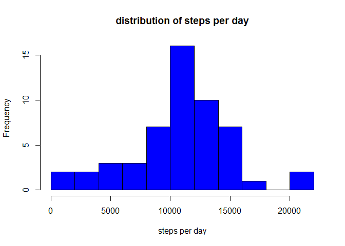
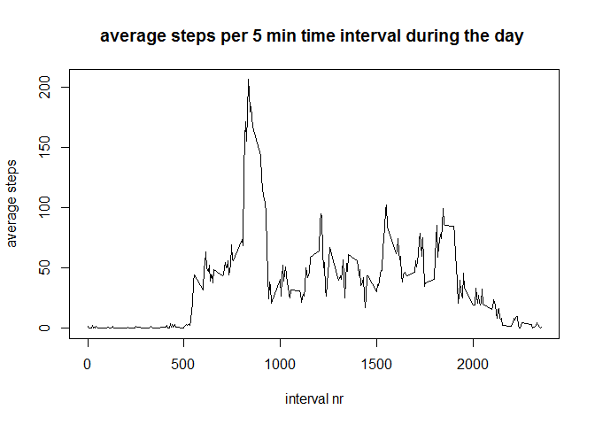
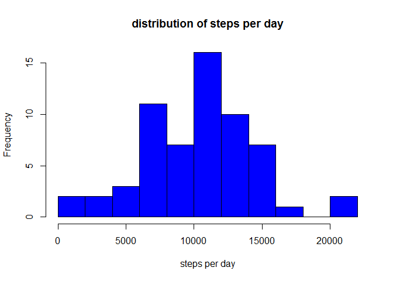
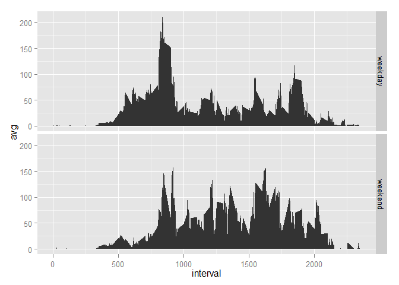

# Reproducible Research: Peer Assessment 1
Coursera student 75055  
Tuesday, December 09, 2014  
  .  
  .  

## step 0 - load the used packages


```r
library(sqldf)
```

```
## Loading required package: gsubfn
## Loading required package: proto
## Loading required package: RSQLite
## Loading required package: DBI
```

```r
library(ggplot2)
```
  .  
  .  

## step 1- Loading and preprocessing the data

Download the data from the internet.


```r
if (!file.exists("activity.csv")) {
    url  = "https://d396qusza40orc.cloudfront.net/repdata%2Fdata%2Factivity.zip"
    dest = "activity.zip"
    meth = "internal"
    quit = TRUE
    mode = "wb"
    download.file(url, dest, meth, quit, mode)
    unzip("activity.zip")
# NOTE this works under windows 7, modify if nessesairy
} 
```

The file used in development of this script was downloaded on 9 December 2014.

Read activity.csv into a data-frame data.

```r
data <- read.csv("activity.csv")
```

Sort the records by date and interval number.  
Show the first six records from the table data.

```r
data <- data[order(data$date,data$interval),]
head(data)
```

```
##   steps       date interval
## 1    NA 2012-10-01        0
## 2    NA 2012-10-01        5
## 3    NA 2012-10-01       10
## 4    NA 2012-10-01       15
## 5    NA 2012-10-01       20
## 6    NA 2012-10-01       25
```
  .  
  .  

## step 2 - What is mean total number of steps taken per day?

Calculate the total steps taken each day and remove the records with NA's.


```r
result <- sqldf("
    SELECT date, sum(steps) AS sum
    FROM data
    WHERE steps != 'NA'
    GROUP BY date
")
```

```
## Loading required package: tcltk
```

show the first 6 records from the result table

```r
head(result)
```

```
##         date   sum
## 1 2012-10-02   126
## 2 2012-10-03 11352
## 3 2012-10-04 12116
## 4 2012-10-05 13294
## 5 2012-10-06 15420
## 6 2012-10-07 11015
```

Show a histogram for the total steps per day.


```r
hist(result[,2],
     xlab = "steps per day",
     main = "distribution of steps per day",
     col = "blue",
     breaks = 10
     )
```

 

Show the mean and the median steps per day   
(for days that at least one step was recorded)


```r
cat("the mean is", mean(result[,2]),"and the median is",median(result[,2]))
```

```
## the mean is 10766.19 and the median is 10765
```
  .  
  .  

## step 3 - What is the average daily activity pattern?

Make a table with the average steps per daily time interval.


```r
result2 <- sqldf("
    SELECT interval, avg(steps) AS avg
    FROM data
    WHERE steps != 'NA'
    GROUP BY interval
    ORDER BY interval
")
```

Show the average steps per time interval during the day.


```r
plot(result2[,1],result2[,2], 
     type= "l",
     xlab = "interval nr",
     ylab = "average steps",
     main = "average steps per 5 min time interval during the day "
     )
```

 

Find the time interval with the maximum average number of steps.


```r
result3 <- sqldf("
    SELECT interval, avg AS max
    FROM result2
    WHERE avg IS (SELECT MAX(avg) FROM result2)
")

head(result3)
```

```
##   interval      max
## 1      835 206.1698
```

```r
cat("interval", result3[1,1],"has the maximum of", result3[1,2],"steps")
```

```
## interval 835 has the maximum of 206.1698 steps
```
  .  
  .  

## step 4 - Imputing missing values

Count how many records in the table data have a NA in the steps column.


```r
result4 <- sqldf("
    SELECT COUNT(*) AS NA_count
    FROM data
    WHERE steps IS NULL
")

head(result4)
```

```
##   NA_count
## 1     2304
```

```r
cat("the column steps has",result4[1,1],"NA values")
```

```
## the column steps has 2304 NA values
```

Strategy for replacing the NA's:   
replace the NA values by the mean value of the appropriate interval.  
**NOTE** The mean values can be found in the table result2.  


```r
cnt = 0
for (idx in 1:nrow(data)){
    if(is.na(data[idx,1])) {
       idx2 = data[idx,3]/5 + 1  # interval 0 has idx2 1, 5 has 2, 10 has 3 etc.
       steps.avg    = result2[idx2,2] # get the appropiate average from result2
       data[idx,1] <- steps.avg
       cnt=cnt+1
    }
}
cat("there are",cnt,"NA values replaced by the appropriate interval mean")
```

```
## there are 2304 NA values replaced by the appropriate interval mean
```
 
 Repeat the calculations of step 2 for the corrected data to see if there are different outcomes.
 
  Calculate the total steps taken each day.
 

```r
 result5 <- sqldf("
     SELECT date, sum(steps) AS sum
     FROM data
     GROUP BY date
 ")
```
 
 show the first 6 records from the result5 table
 

```r
 head(result5)
```

```
##         date      sum
## 1 2012-10-01  7075.34
## 2 2012-10-02   126.00
## 3 2012-10-03 11352.00
## 4 2012-10-04 12116.00
## 5 2012-10-05 13294.00
## 6 2012-10-06 15420.00
```

 
Show a histogram for the total steps per day.
 

```r
hist(result5[,2],
     xlab = "steps per day",
     main = "distribution of steps per day",
     col = "blue",
     breaks = 10
     )
```

 
 
Show the mean and the median steps per day   
(for days that at least one step was recorded)
 

```r
cat("the mean is", mean(result5[,2]),"and the median is",median(result5[,2]))
```

```
## the mean is 10282.14 and the median is 10395
```

After the replacement of the NA's by the appropriate averages the

- mean is smaller (was 10766.19 is now 10282.14)
- median is smaller (was 10765 is 10395)
- the histogram is now bimodal (was mono modal)

Comparing the histograms, we see that the NA's occurred mainly in the interval of say 600 to 800 steps. Here many missing values were replaced. The becoming weightier of this interval makes the mean and the median smaller.

  .  
  .  

## Step 5 - Are there differences in activity patterns between weekdays and weekends?

Add a variable daytype (either weekday or weekend) to the data-frame data. 


```r
data[,4] <- weekdays(as.Date(data[,2]))
names(data)[4] <- "daytype" 

for (idx in 1:nrow(data)) {
    dag <- data[idx,4]
    if(dag == "zaterdag" | dag == "zondag") { 
        data[idx,4] <- "weekend"
    } else {
        data[idx,4] <- "weekday"
    }
}
# NOTE this works in Dutch, to make it work in English,  
#      replace zaterdag and zondag by saterday and sunday.
```

Calculate for weekends and weekdays the average steps for each interval.  
Show the results.


```r
result6 <- sqldf("
    SELECT daytype, interval, avg(steps) AS avg
    FROM data
    GROUP BY daytype, interval
    ORDER BY daytype, interval
")

p <- ggplot(result6, aes(x=interval, y=avg)) + geom_area()
p + facet_grid(daytype ~ .)
```

 

